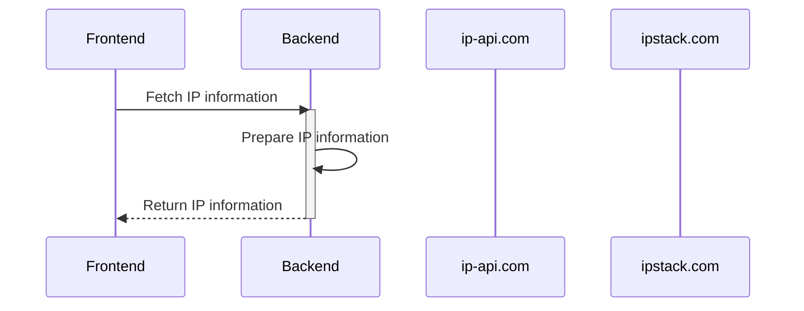

# Backend of IP detection service

> This project is for demostrate setting up the backend of an user IP detection service on AWS serverless cloud environment. 

The backend service is a AWS lambda function developed with Node.js Serverless Framework. 

Live Demo: https://api.weijing329.studio/demo/ip

## Backend Process Flow Diagram


## Run backend application locally

``` bash
# Install serverless framework globally
$ npm install serverless -g

# Change working directory to this project folder
$ cd serverless-demo-api

# install dependencies
$ npm install # Or yarn install

# Starting offline server at localhost:3000
$ npm run start-sls
# or
$ sls offline start
```


## Setup AWS credentials for serverless framework

1. Login AWS console
2. Go to Sercurity & Identity => Identity &  Access Management (IAM)
3. IAM Management Console => Users => Create New Users

Create an new IAM user with following setting
name: serverless-demo
access type: programmatic access
Set permissions => Attach existing policies directly => AdministractorAccess
Review => Create User

Keep new user credentials **Access Key ID** & **Secret Access Key** handy for serverless framework configuration

``` bash
# configure AWS profiles for serverless framework
$ serverless config credentials --provider aws --key <Access Key ID> --secret <Secret Access Key>
```

## Setup AWS API Gateway custom domain

Configure API Gateway to use my own domain name for an API and Stage, also backed by an ACM certificate for HTTPS connection.

> This part, I configured through AWS console website. If details are required, I can provide screenshot.

## Build and deploy project to AWS using Serverless Framework

Serverless Framework will using serverless.yml in the project folder (Infrastructure as code) to generate AWS Resource CloudFormation template, automatically upload to S3 bucket, and create AWS resouce stack as specified in the CloudFormation template.

``` bash
# Change working directory to this project folder
$ cd serverless-demo-api

# Build & deploy project
$ npm run deploy
# or 
$ sls deploy
```

## Enable AWS API Gateway CORS for frontend local testing

> This part, I configured through AWS console website. If details are required, I can provide screenshot.
